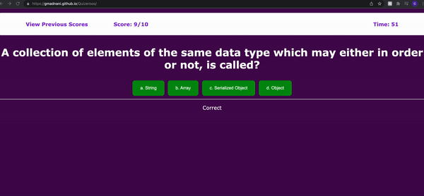
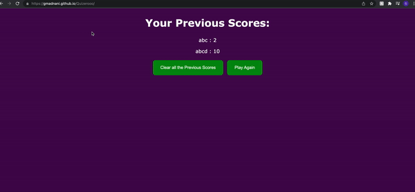

## Table of Contents
- [Task](#task)
- [Quiz Description](#Quiz-description)
- [GIF](#gif)
- [Website](#website)

## Task
The purpose of this project is to create a timed quiz on Javascript fundamentals. It also stores the scores of the quiz taken. The quiz can either when all questions are answered or if the time runs out. The final scored will be displayed when the quiz ends where you can play again or save your score by entering your name. 

## Quiz Description 
Quizerooo is a competitive quiz website that test your javascript fundamentals at a beginner level. It includes a timer and a high score feature to test and get better progressively. All The Best!

## GIF

  
  
Fig 1: finishing the quiz and entering a name

   

  
  
Fig 2: viewing previous results and clearing it

   

## Website
https://gmadnani.github.io/Quizerooo/

https://github.com/gmadnani/Quizerooo/

## License
[MIT](https://choosealicense.com/licenses/mit/)
